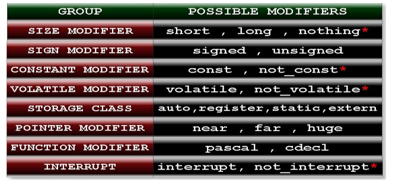

# memory-structures-and-pointers
MS-DOS (/ˌɛmˌɛsˈdɒs/ em-es-DOSS; acronym for Microsoft Disk Operating System, also known as Microsoft DOS) is an operating system for x86-based personal computers mostly developed by Microsoft. Collectively, MS-DOS, its rebranding as IBM PC DOS, and a few operating systems attempting to be compatible with MS-DOS, are sometimes referred to as "DOS" (which is also the generic acronym for disk operating system). MS-DOS was the main operating system for IBM PC compatibles during the 1980s, from which point it was gradually superseded by operating systems offering a graphical user interface (GUI), in various generations of the graphical Microsoft Windows operating system.

$ gcc hello.c -o hello.exe

-o hello.exe: This flag tells GCC to generate an executable file named "hello.exe" as the output of compiling the "hello.c" source code file.

GCC (GNU Compiler Collection) is a compiler toolchain that provides a suite of compilers for various programming languages, including C, C++, Objective-C, and Fortran. GCC is widely used for compiling and building software applications on Unix-like operating systems such as Linux, macOS, and various flavors of BSD.

  gcc hello.c -o hello.exe
-o hello.exe: This flag tells GCC to generate an executable file named "hello.exe" as the output of compiling the "hello.c" source code file.

2^10 = 1KB 
2^20 = 1MB 
2^30 = 1GB

Accessing Invalid Memory: If a program tries to access memory outside the bounds of an allocated memory region, it can result in a segmentation fault. For example, accessing an array element beyond its bounds or dereferencing a pointer that points to invalid memory can trigger a segmentation fault.
c
Copy code
int arr[5];
arr[10] = 42; 

 In turbo c 3.0 physical addresses of any variables are stored in the 20 bits. But we have not any pointers (We will discuss later what is pointer?)of size 20 bits. So pointers cannot access whole residence memory address.To solve this problem we there are three types pointers in c language. They are 
1. Near pointer 
2. Far pointer
 3. Huge pointer

 memory address of any variable in c has two parts segment number and offset address.

Automatic variables have automatic storage duration, meaning that they are created when the block or function containing them is entered, and they are destroyed when that block or function is exited. 

a "garbage value" refers to the value held by a variable that has not been initialized or assigned a specific value by the programmer. 

static: When a variable is declared as static, it means that the variable retains its value between function calls. It has a lifetime that spans the entire execution of the program, and its value persists across multiple invocations of the function in which it is defined. 

All static and extern variable are stored in the data area. It is permanent memory space and variable will store in the memory unless and until program end. 

Name of identifier is 
case sensitive i.e. num and Num are two 
different variables. 
Rule 8: Only first 32 characters are significant of identifier name.
Example: 
abcdefghijklmnopqrstuvwxyz123456aaa, 
abcdefghijklmnopqrstuvwxyz123456bbb, 
abcdefghijklmnopqrstuvwxyz123456cad
All three identifier name are same because only first 32 characters has 
meaning. Rest has not any importance.

#include<math.h>
#include<stdio.h>
int main(){
int M_PI=25;
printf("%d"
return
,M_PI);
0;
}
Output: Compilation error
Explanation: M_PI is constant name which has been defined in header file 
math.h hence it cannot be variable in c.

signedInt can hold both positive and negative integer values, while unsignedInt can only hold non-negative integer values

%d: It is used to print signed decimal number.
%u: It is used to print unsigned decimal number.

modifiers are keywords that modify the behavior or properties of identifiers such as variables, functions, or data types. They provide additional information or constraints to the compiler, affecting how the program is compiled or executed. 

If you will not write any modifiers of a particular group then c compiler will take default modifier of that group. Default modifier of each group has written in the following table: 

Default data type is opposite of default modifier as you read in the above topic. In case of only SIZE, SIGN, STORAGE CLASS, CONSTANT, and VOLATILE modifier compile automatically assumes int as a default data type. For example: (1) long a=25; It is equivalent to: long int a=25; (2) signed a=25; It is equivalent to: signed int a=25; (3) register a=25; It is equivalent to: unsigned register int a=25; 

Sizeof- returns size in bytes

volatile: Indicates that the value of the variable can be changed at any time by something outside the program, such as hardware or another thread.

For example, let's take the decimal number 42:
In binary, 42 is represented as 00101010.
Each bit position represents a power of 2: 2^5 + 2^3 + 2^1 = 32 + 8 + 2 = 42.
So, in the binary representation 00101010:
The leftmost bit is the sign bit, indicating whether the number is positive (0) or negative (1).
The remaining 7 bits represent the magnitude of the number.
(00101010)₂ = (0 × 2⁷) + (0 × 2⁶) + (1 × 2⁵) + (0 × 2⁴) + (1 × 2³) + (0 × 2²) + (1 × 2¹) + (0 × 2⁰) = (42)₁₀

int main(){
int near * ptr=( int *)0XFFFF;
ptr++;
ptr++;
printf(“%p”,ptr);
return 0;
}
Output: 0003 explain

Generic pointers, also known as void pointers, are a special type of pointer in C that can point to objects of any data type. They are declared using the void * data type.
Here's why they're called "generic" and how they're used:
Generic Nature: Unlike other pointer types (such as int *, char *, etc.), which are specific to particular data types, a void * pointer is not associated with any specific data type. It can point to objects of any data type.

#include int main(){ #ifndef NULL #define NULL 5 #endif printf("%d",NULL+sizeof(NULL)); return 0; } Output: 2 Explanation: NULL+sizeof(NULL) =0+sizeoof(0) =0+2 //size of int data type is two byte.

The pointer which can point or access whole the residence memory of RAM i.e. which can access all 16 segments is known as far pointer.
Size of far pointer is 4 byte or 32 bit.

Huge pointer: The pointer which can point or access whole the residence memory of RAM i.e. which can access all the 16 segments is known as huge pointer.

Size of huge pointer is 4 byte or 32 bit.

Explanation: q is far pointer, p is near pointer, *p is double data type constant. Don’t use huge pointer: If you will increment huge pointer it will increment both offset and segment address unlike to far pointer which only increments offset address. So if you have little knowledge about huge pointer and you are using huge pointer then you can easily access and modify the IVT, device driver memory, video memory etc. This might be dangerous for your computer. 

Code Segment:
Also known as the text segment.
This segment stores executable code, such as instructions and program logic.
It is typically read-only to prevent accidental modification of program instructions.
Instructions fetched from the code segment are executed by the CPU.
Data Segment:
The data segment stores initialized global and static variables.
Initialized variables have predefined values assigned at compile-time.
Variables in the data segment persist throughout the program's execution.
Stack Segment:
The stack segment is used for storing local variables, function parameters, and return addresses.
It grows and shrinks dynamically as functions are called and return.
Each function call creates a new stack frame, which contains information about the function's execution context.
Stack memory is typically organized as a Last-In-First-Out (LIFO) structure.

Static memory is used for static and global variables. Access anywhere
Heap memory is used for dynamically allocated memory.(eg-pointers)
Stack memory is used for automatic variables and function call information. (deleted when go out of scope)

The new operator is used to dynamically allocate memory on the heap. It returns a pointer to the allocated memory. It is often used to allocate memory for single objects, arrays, or objects with constructors.

The delete operator is used to release memory that was previously allocated using new. It deallocates memory from the heap

Syntax:
Pointers are declared using the * symbol, and they hold the memory address of an object. Example: int* ptr;
References are declared using the & symbol, and they are aliases for objects. Example: int& ref = x;
Initialization:
Pointers can be declared without initialization, or they can be initialized to nullptr or a valid memory address. Example: int* ptr = nullptr; or int* ptr = &x;
References must be initialized when declared, and they cannot be reseated to refer to a different object after initialization. Example: int& ref = x;
Nullability:
Pointers can be null, meaning they do not point to any valid memory address. You need to check for null pointers before dereferencing them to avoid undefined behavior.
References cannot be null; they must always refer to a valid object. Therefore, there is no need to check for null references.
 NULL is Not a Valid Memory Location: NULL is used to signify that the pointer is not currently pointing to any valid memory location.

Dereferencing:
To access the value pointed to by a pointer, you use the dereference operator *. Example: int value = *ptr;
References are automatically dereferenced when used; you do not need to explicitly dereference them. Example: int value = ref;
Memory Management:
Pointers allow dynamic memory allocation and deallocation using new and delete.
References do not participate in memory management; they are simply aliases for existing objects.
Reassignment:
Pointers can be reassigned to point to different objects. Example: ptr = &y;
References cannot be reseated to refer to a different object after initialization. Once initialized, they always refer to the same object.
Function Parameters:
Pointers are often used to pass arguments to functions by reference.
References are another way to pass arguments to functions by reference, providing cleaner syntax.
Arithmetic Operations:
Pointers support arithmetic operations like addition, subtraction, and comparison.
References do not support arithmetic operations; they behave like constant pointers in this regard.

the instruction bus is primarily responsible for fetching instructions from memory for the CPU to execute, while the data bus handles the transfer of data between the CPU, memory, and peripherals. 

The single-precision floating-point format consists of three parts: the sign bit, the exponent, and the mantissa (also known as the significand).

stack memory is typically allocated statically, meaning the size of memory required for variables declared on the stack must be known at compile time.

char: Typically 1 byte.
int: Typically 4 bytes on 32-bit systems and 4 or 8 bytes on 64-bit systems.
float: Typically 4 bytes.
double: Typically 8 bytes.
short: Typically 2 bytes.
long: Typically 4 bytes on 32-bit systems and 8 bytes on 64-bit systems.
long long: Typically 8 bytes.
pointer: Typically 4 bytes on 32-bit systems and 8 bytes on 64-bit systems.

UART is a commonly used serial communication protocol that allows devices to communicate with each other over a serial interface. It is widely used in embedded systems for communication between microcontrollers, sensors, actuators, and other peripheral devices.

#include <stdio.h>
2#include <stdlib.h>
3
4void foo() {
5    int *arr = (int *)malloc(10 * sizeof(int));
6    // Do some work with arr
7    // Forget to call free(arr)
8}
9
10int main() {
11    foo();
12    // Memory leak: arr is never deallocated
13    return 0;
14}

owever, the critical issue is that the function foo() fails to release (deallocate) the memory block before returning. It neglects to call the free() function to release the memory allocated by malloc(). As a result, when the foo() function completes its execution, the pointer arr goes out of scope, but the memory it was pointing to remains allocated and inaccessible to the program.

The ith element of an array can be accessed in a constant time via arr[i]. It is located at the address arr + i * sizeof(int). Here, the arr is the address of the first element in the array, in the above case 0x400.

1. Declaring a function parameter as int arr[] is syntactically equivalent to declaring it as int* arr.
2. ptr + 1 gives you the address of arr[1], ptr + 2 gives you the address of arr[2], and so on.
Copying an Array: The time taken to copy each element of the array grows linearly with the array's size. For large arrays, this copying process can be slow.
Passing a Pointer: Passing a pointer is a constant-time operation, as only the address is transferred, which is very quick.
You can access all elements of the array using the pointer arithmetic ptr + i where i ranges from 0 to the size of the array minus one.
Passing an Array: When you pass an array to a function, you actually pass a pointer to the first element of the array.
Accessing Elements: The function can access the array elements using either array indexing (arr[i]) or pointer arithmetic (*(arr + i)).

The value @ address: 0x7fff5a513d50: 10
The value @ address: 0x7fff5a513d54: 20
The value @ address: 0x7fff5a513d58: 30
The value @ address: 0x7fff5a513d5c: 40
The value @ address: 0x7fff5a513d60: 50

Passing by reference in programming languages like C or C++ allows a function to modify the original variable's value directly, rather than working with a copy of the variable. This is done by passing the memory address (pointer) of the variable to the function

char s[4][20] = {"Example 1", "Example 2", "Example 3", "Example 4"};

This line does several things:
Declares a 2D array s of size 4x20, which means it can hold 4 strings, each up to 19 characters long plus the null terminator ('\0').
Initializes each row (string) of the array with the specified values.

Q: Since array references decay into pointers, if arr is an array, what's the difference between arr and &arr?
arr: Decays to int* (pointer to the first element).
&arr: Is of type int (*)[5] (pointer to the entire array of 5 integers).

—>void pointer’s value cant be assigned as *ptr=10. Bcz no data type given so computer doesnt know how much memory to allocate.

Type casting in pointers-

