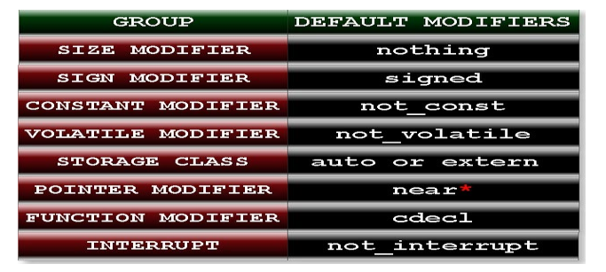

# memory-structures-and-pointers
MS-DOS (/ˌɛmˌɛsˈdɒs/ em-es-DOSS; acronym for Microsoft Disk Operating System, also known as Microsoft DOS) is an operating system for x86-based personal computers mostly developed by Microsoft. Collectively, MS-DOS, its rebranding as IBM PC DOS, and a few operating systems attempting to be compatible with MS-DOS, are sometimes referred to as "DOS" (which is also the generic acronym for disk operating system). MS-DOS was the main operating system for IBM PC compatibles during the 1980s, from which point it was gradually superseded by operating systems offering a graphical user interface (GUI), in various generations of the graphical Microsoft Windows operating system.

$ gcc hello.c -o hello.exe

-o hello.exe: This flag tells GCC to generate an executable file named "hello.exe" as the output of compiling the "hello.c" source code file.

GCC (GNU Compiler Collection) is a compiler toolchain that provides a suite of compilers for various programming languages, including C, C++, Objective-C, and Fortran. GCC is widely used for compiling and building software applications on Unix-like operating systems such as Linux, macOS, and various flavors of BSD.

  gcc hello.c -o hello.exe
-o hello.exe: This flag tells GCC to generate an executable file named "hello.exe" as the output of compiling the "hello.c" source code file.

2^10 = 1KB 
2^20 = 1MB 
2^30 = 1GB

Accessing Invalid Memory: If a program tries to access memory outside the bounds of an allocated memory region, it can result in a segmentation fault. For example, accessing an array element beyond its bounds or dereferencing a pointer that points to invalid memory can trigger a segmentation fault.
c
Copy code
int arr[5];
arr[10] = 42; 

 In turbo c 3.0 physical addresses of any variables are stored in the 20 bits. But we have not any pointers (We will discuss later what is pointer?)of size 20 bits. So pointers cannot access whole residence memory address.To solve this problem we there are three types pointers in c language. They are 
1. Near pointer 
2. Far pointer
 3. Huge pointer

 memory address of any variable in c has two parts segment number and offset address.

Automatic variables have automatic storage duration, meaning that they are created when the block or function containing them is entered, and they are destroyed when that block or function is exited. 

a "garbage value" refers to the value held by a variable that has not been initialized or assigned a specific value by the programmer. 

static: When a variable is declared as static, it means that the variable retains its value between function calls. It has a lifetime that spans the entire execution of the program, and its value persists across multiple invocations of the function in which it is defined. 

All static and extern variable are stored in the data area. It is permanent memory space and variable will store in the memory unless and until program end. 

Name of identifier is 
case sensitive i.e. num and Num are two 
different variables. 
Rule 8: Only first 32 characters are significant of identifier name.
Example: 
abcdefghijklmnopqrstuvwxyz123456aaa, 
abcdefghijklmnopqrstuvwxyz123456bbb, 
abcdefghijklmnopqrstuvwxyz123456cad
All three identifier name are same because only first 32 characters has 
meaning. Rest has not any importance.

#include<math.h>
#include<stdio.h>
int main(){
int M_PI=25;
printf("%d"
return
,M_PI);
0;
}
Output: Compilation error
Explanation: M_PI is constant name which has been defined in header file 
math.h hence it cannot be variable in c.

signedInt can hold both positive and negative integer values, while unsignedInt can only hold non-negative integer values

%d: It is used to print signed decimal number.
%u: It is used to print unsigned decimal number.

modifiers are keywords that modify the behavior or properties of identifiers such as variables, functions, or data types. They provide additional information or constraints to the compiler, affecting how the program is compiled or executed. 

If you will not write any modifiers of a particular group then c compiler will take default modifier of that group. Default modifier of each group has written in the following table: 

Default data type is opposite of default modifier as you read in the above topic. In case of only SIZE, SIGN, STORAGE CLASS, CONSTANT, and VOLATILE modifier compile automatically assumes int as a default data type. For example: (1) long a=25; It is equivalent to: long int a=25; (2) signed a=25; It is equivalent to: signed int a=25; (3) register a=25; It is equivalent to: unsigned register int a=25; 

Sizeof- returns size in bytes
